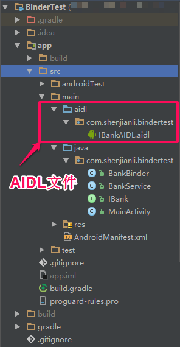
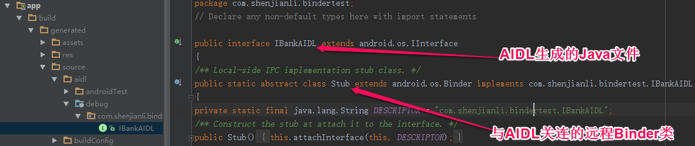
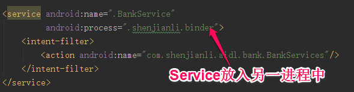
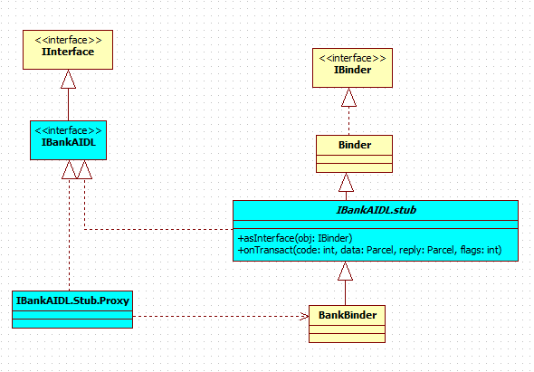
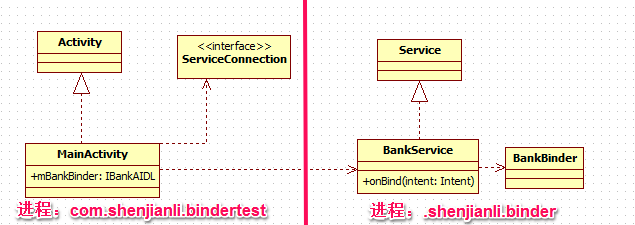
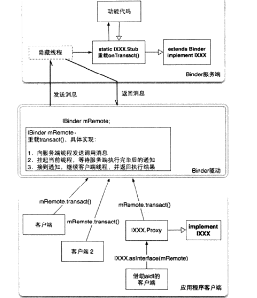
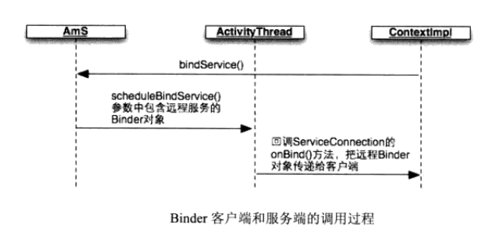

## 实例效果：

## 实例结构：

## 关键代码：

**1.根据不同业务需求，定义aidl文件**

```
// IBankAIDL.aidl
package com.shenjianli.bindertest;

interface IBankAIDL {

    String openAccount(String name,String password);

    String saveMoney(int money,String account);

    String takeMoney(int money,String account,String password);

    String closeAccount(String account,String password);
}
```
经过编译后会在app/build/generated/source/aidl/debug目录下生成IBankAIDL.java文件，如下图所求：


**2.根据生成的IBankAIDL.java来编写BankBinder.java文件**

```
package com.shenjianli.bindertest;

import java.util.UUID;

/**
 * Created by shenjianli on 16/11/18.
 * public class BankBinder extends Binder implements IBank
 *  利用AIDL生成的类来实现远程Binder并传递参数
 */
public class BankBinder extends IBankAIDL.Stub{
    @Override
    public String openAccount(String name, String password) {
        return name + "开户成功！账号为：" + UUID.randomUUID().toString();
    }

    @Override
    public String saveMoney(int money, String account) {
        return "账户：" + account + " 存入 " + money + "单位  人民币";
    }

    @Override
    public String takeMoney(int money, String account, String password) {
        return "账户" + account + " 支取 " + money + " 单位  人民币";
    }

    @Override
    public String closeAccount(String account, String password) {
        return account + "销户成功！";
    }
}

```
其中BankBinder类继承于IBankAIDL.Stub类，关于IBankAIDL.Stub类如第一点上图所示，其继承于Binder类，实现了IBankAIDL接口。

**3.使用Service来模拟远程进程的服务**

```
package com.shenjianli.bindertest;

import android.app.Service;
import android.content.Intent;
import android.os.IBinder;
import android.support.annotation.Nullable;

/**
 * Created by shenjianli on 16/11/18.
 */
public class BankService extends Service{
    @Nullable
    @Override
    public IBinder onBind(Intent intent) {
        return new BankBinder();
    }
}

```
上面代码定义好了BankService，并在onBind方法中返回我们上面所实现的Binder类。接下来，我们需要把这个Service放入到另一个进程中。如下图所求进行配置：


**4.客户端调用另一进程中方法，得到返回值**

```
package com.shenjianli.bindertest;

import android.content.ComponentName;
import android.content.Intent;
import android.content.ServiceConnection;
import android.os.Bundle;
import android.os.IBinder;
import android.os.RemoteException;
import android.support.v7.app.AppCompatActivity;
import android.view.View;
import android.widget.Button;
import android.widget.TextView;

import butterknife.Bind;
import butterknife.ButterKnife;
import butterknife.OnClick;

public class MainActivity extends AppCompatActivity {

    @Bind(R.id.open_account)
    Button mOpenAccount;
    @Bind(R.id.save_money)
    Button mSaveMoney;
    @Bind(R.id.get_money)
    Button mGetMoney;
    @Bind(R.id.close_account)
    Button mCloseAccount;
    @Bind(R.id.text_info)
    TextView mTextInfo;

    //private BankBinder mBankBinder;

    //Client来保存远程Service端的引用
    private IBankAIDL mBankBinder;

    @Override
    protected void onCreate(Bundle savedInstanceState) {
        super.onCreate(savedInstanceState);
        setContentView(R.layout.activity_main);
        ButterKnife.bind(this);

        //Client进行Service绑定
        Intent intent = new Intent(this,BankService.class);
        intent.setAction("com.shenjianli.aidl.bank.BankService");
        bindService(intent,conn,BIND_AUTO_CREATE);

    }

    private ServiceConnection conn = new ServiceConnection() {
        @Override
        public void onServiceConnected(ComponentName name, IBinder binder) {
            //mBankBinder = (BankBinder) binder;
            //绑定成功后，获得远程Binder的引用
            mBankBinder = IBankAIDL.Stub.asInterface(binder);
        }

        @Override
        public void onServiceDisconnected(ComponentName name) {

        }
    };

    //点击按钮后，调用另一进行中Binder中的方法获得返回值
    @OnClick({R.id.open_account, R.id.save_money, R.id.get_money, R.id.close_account})
    public void onClick(View view) {
        switch (view.getId()) {
            case R.id.open_account:
                try {
                    mTextInfo.setText(mBankBinder.openAccount("shenjianli","cqtddt@163.com"));
                } catch (RemoteException e) {
                    e.printStackTrace();
                }
                break;
            case R.id.save_money:
                try {
                    mTextInfo.setText(mBankBinder.saveMoney(1000000000,"shenjianli"));
                } catch (RemoteException e) {
                    e.printStackTrace();
                }
                break;
            case R.id.get_money:
                try {
                    mTextInfo.setText(mBankBinder.takeMoney(100,"shenjianli","cqtddt@163.com"));
                } catch (RemoteException e) {
                    e.printStackTrace();
                }
                break;
            case R.id.close_account:
                try {
                    mTextInfo.setText(mBankBinder.closeAccount("shenjianli","cqtddt@163.com"));
                } catch (RemoteException e) {
                    e.printStackTrace();
                }
                break;
        }
    }

    @Override
    protected void onDestroy() {
        super.onDestroy();
        //进行解绑Service
        unbindService(conn);
    }
}
```
## UML图
**1.实例UML**


图中uml图中蓝色表示我们通常aidl来生成的IBandAIDL.java文件
**2.实例使用的两个进程**


当实例运行起来后，图中左边几个对象运行于com.shenjianli.bindertest进程；图中右边几个对象运行于.shenjianli.binder进程中；在MainActivity中使用mBandBinder（远程引用）来调用远程进程BankService中BankBinder中的方法来返回处理数据。

## 知识介绍：
### Binder原理图


**1.Binder服务端**

**2.Binder驱动**

重载了transact()方法，主要包括以下内容:
1.以线程间消息通信的模式，向服务端发送客户端传递过来的参数
2.挂起当前线程，当前线程正是客户端线程，并等待服务器线程执行完指定服务函数通知（notify）
3.接收到服务端线程通知，然后继续执行客户端线程，并返回到客户端代码区

**3.应用程序客户端**


### Client端调用远程服务的过程


在Android中，Binder用于完成进程间通信（IPC）,即把多个进程“别”在一起，比如，普通应用程序可以调用音乐播放服务提供的播放，暂停，停止等功能！

### 普通自定义Binder存在问题
**1.客户端如何获得服务端的Binder对象引用**

```
public boolean bindService(Intent service,ServiceConnection conn,int flags)
```
这个函数用于绑定一个服务，其中第二个参数interface类定义如下

```
public interface ServiceConnection{
	public void onServiceConnected(ComponentName name ,IBinder service);
    public void onServiceDisconnected(ComponentName name);	
}
```
当客户端请求Ams启动某个Service后，该Service如果正常启动，那么Ams就会远程调用ActivityThread类中的ApplicationThread对象，调用参数中会包含Service的Binder引用，然后在ApplicationThread中会回调bindService中的conn接口。因此，在客户端中，可以在onServiceConnected()方法中将其参数Service保存为一个全局变量，从而在客户端的任何地方都可以调用该远程服务！

```
/**
 * Cast an IBinder object into an com.shenjianli.bindertest.IBankAIDL interface,
 * generating a proxy if needed.
 */
public static com.shenjianli.bindertest.IBankAIDL asInterface(android.os.IBinder obj)
{
if ((obj==null)) {
return null;
}
android.os.IInterface iin = obj.queryLocalInterface(DESCRIPTOR);
if (((iin!=null)&&(iin instanceof com.shenjianli.bindertest.IBankAIDL))) {
return ((com.shenjianli.bindertest.IBankAIDL)iin);
}
return new com.shenjianli.bindertest.IBankAIDL.Stub.Proxy(obj);
}
```

**2.客户端和服务端必须事先约定好两件事，服务端函数的参数在包裹中的顺序，服务端不同函数的int标识**

aidl 可以把aidl文件转化为一个Java类文件，这个文件同时重载了onTransact()方法，统一了存入包裹和读取包裹参数

```
@Override public boolean onTransact(int code, android.os.Parcel data, android.os.Parcel reply, int flags) throws android.os.RemoteException
{
switch (code)
{
case INTERFACE_TRANSACTION:
{
reply.writeString(DESCRIPTOR);
return true;
}
case TRANSACTION_openAccount:
{
data.enforceInterface(DESCRIPTOR);
java.lang.String _arg0;
_arg0 = data.readString();
java.lang.String _arg1;
_arg1 = data.readString();
java.lang.String _result = this.openAccount(_arg0, _arg1);
reply.writeNoException();
reply.writeString(_result);
return true;
}
case TRANSACTION_saveMoney:
{
data.enforceInterface(DESCRIPTOR);
int _arg0;
_arg0 = data.readInt();
java.lang.String _arg1;
_arg1 = data.readString();
java.lang.String _result = this.saveMoney(_arg0, _arg1);
reply.writeNoException();
reply.writeString(_result);
return true;
}
case TRANSACTION_takeMoney:
{
data.enforceInterface(DESCRIPTOR);
int _arg0;
_arg0 = data.readInt();
java.lang.String _arg1;
_arg1 = data.readString();
java.lang.String _arg2;
_arg2 = data.readString();
java.lang.String _result = this.takeMoney(_arg0, _arg1, _arg2);
reply.writeNoException();
reply.writeString(_result);
return true;
}
case TRANSACTION_closeAccount:
{
data.enforceInterface(DESCRIPTOR);
java.lang.String _arg0;
_arg0 = data.readString();
java.lang.String _arg1;
_arg1 = data.readString();
java.lang.String _result = this.closeAccount(_arg0, _arg1);
reply.writeNoException();
reply.writeString(_result);
return true;
}
}
```

## 参考文献：

[http://blog.csdn.net/huachao1001/article/details/51504469](http://blog.csdn.net/huachao1001/article/details/51504469)

[http://blog.csdn.net/luoshengyang/article/details/6618363](http://blog.csdn.net/luoshengyang/article/details/6618363)

[http://blog.csdn.net/luoshengyang/article/details/6642463](http://blog.csdn.net/luoshengyang/article/details/6642463)

[http://blog.csdn.net/luoshengyang/article/details/6629298](http://blog.csdn.net/luoshengyang/article/details/6629298)

[http://blog.csdn.net/luoshengyang/article/details/6621566](http://blog.csdn.net/luoshengyang/article/details/6621566)